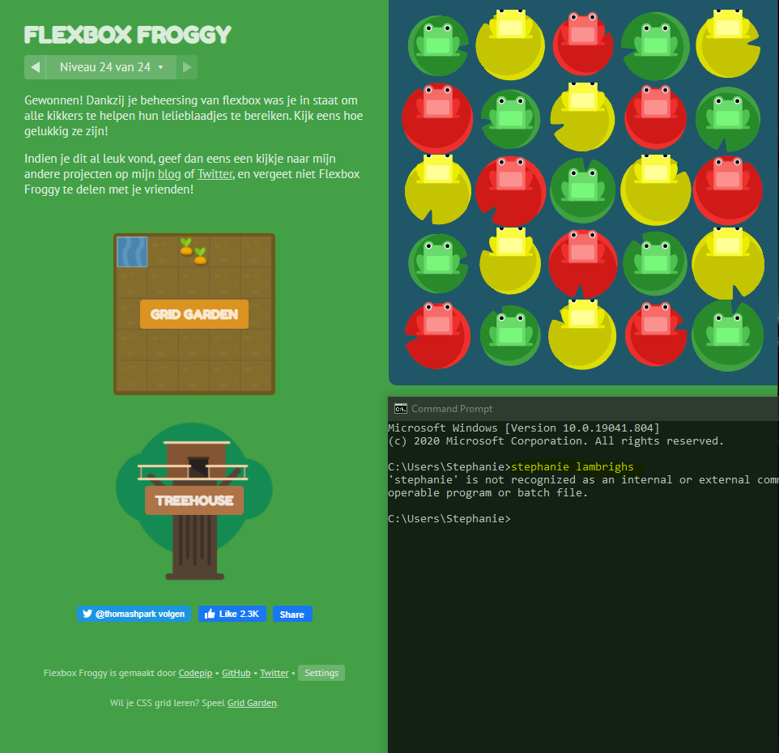
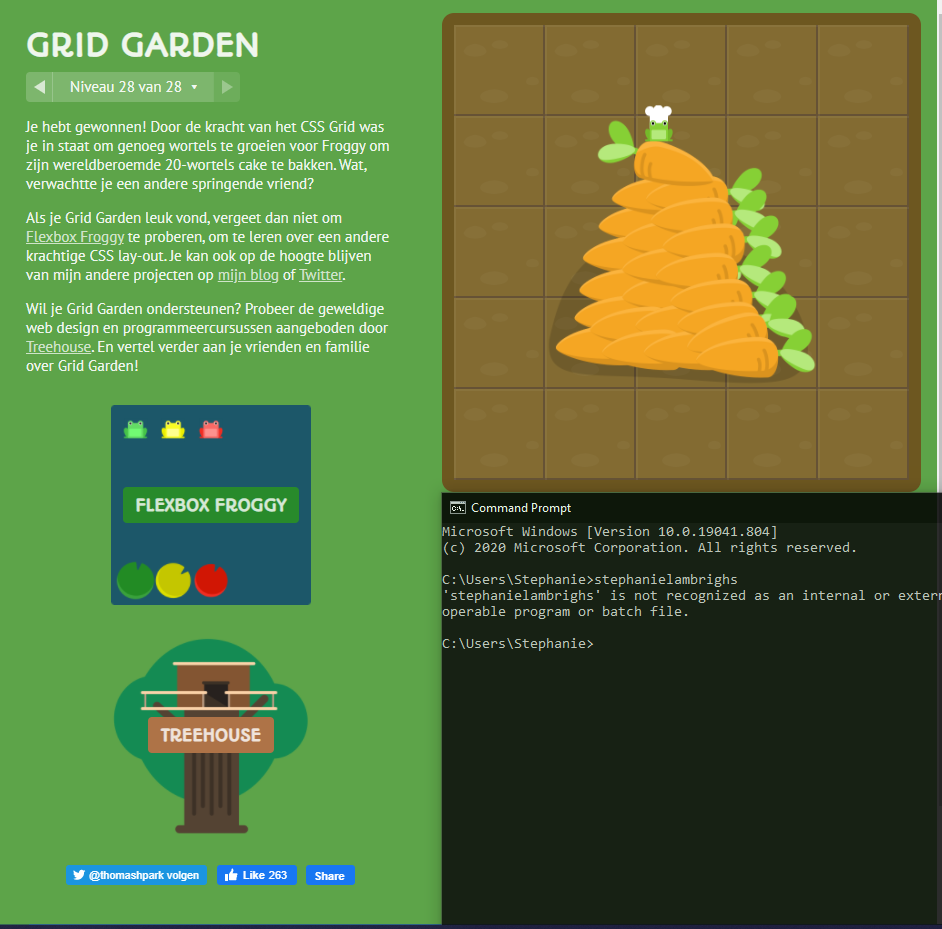
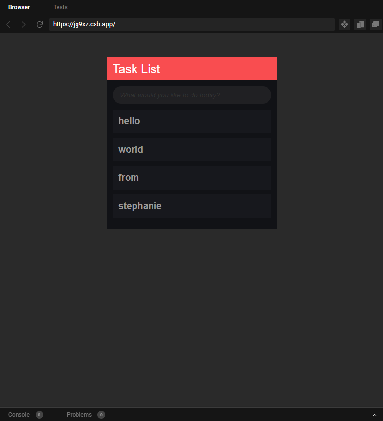
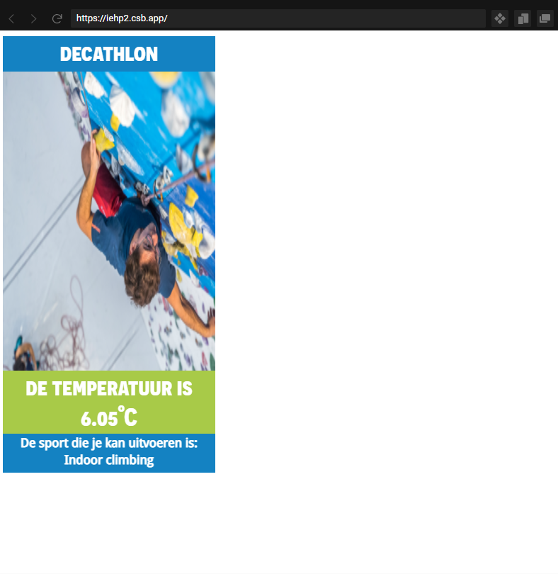
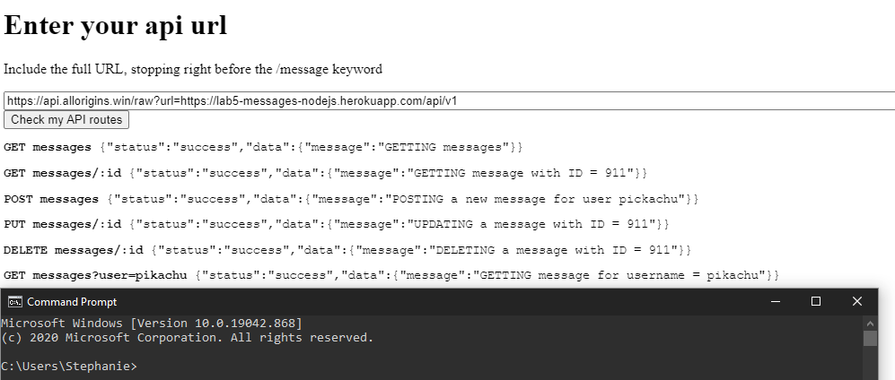

# 2imd-webtechadvanced-portfolio

## Week 1 - GIT
- [Lab1](./lab1-git/README.MD)
- Screenshot Git-it

## Week 2 - CSS Grid + Flexbox
- [Lab2](./lab2/README.md)
- [Link to Codepen](https://codepen.io/Tauriel/pen/ExNoyGv)
- Flexbox Froggy 

- Grid Garden 

## Week 3 - ES6 
- [Lab3](./lab3/README.md)
- [Link to Codesandbox](https://codesandbox.io/s/lab3-todo-app-forked-jg9xz?file=/index.html)

## Week 4 - App prototype
- [lab4](./lab4/README.md)
- [Link to Codesandbox](https://codesandbox.io/s/lab-4-app-prototype-iehp2?file=/index.html)

## Week 5 - NodeJs basics
- [lab5](./lab5/README.md)
- [Link to Codepen](https://codepen.io/Tauriel/pen/zYogyVx)

## Week 6 - Websockets
- [lab6](https://github.com/stephanielambrighs/Lab6/blob/main/README.md)
- [Link to demo in gif](https://github.com/stephanielambrighs/Lab6/blob/main/demo.gif)
- [Link to Heroku application](https://imd-athletes.herokuapp.com/) 